## lab8web
# Nama  : Muhamad Ananda Putra Fraceda
# NIM   : 312310440
# Kelas : TI.23.A4

# 1. Membuat Database & Membuat Tabel
- Gambar 1
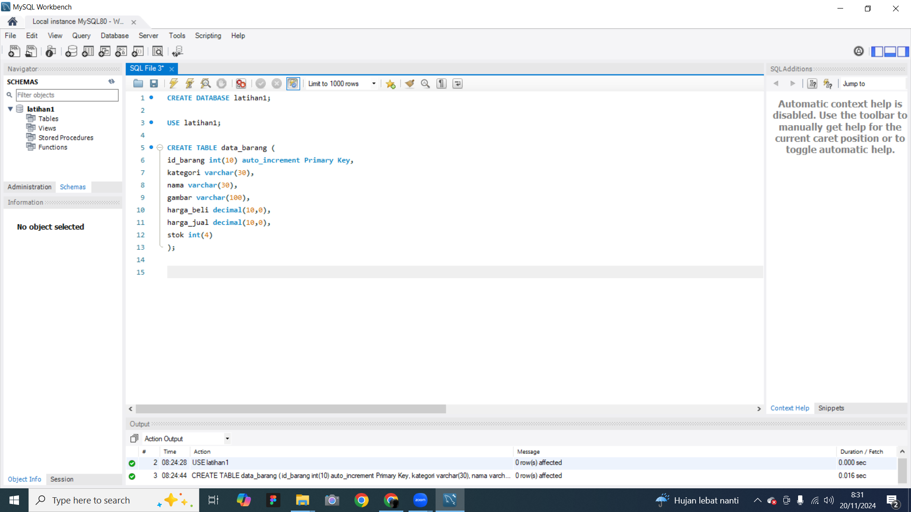
- Gambar 2
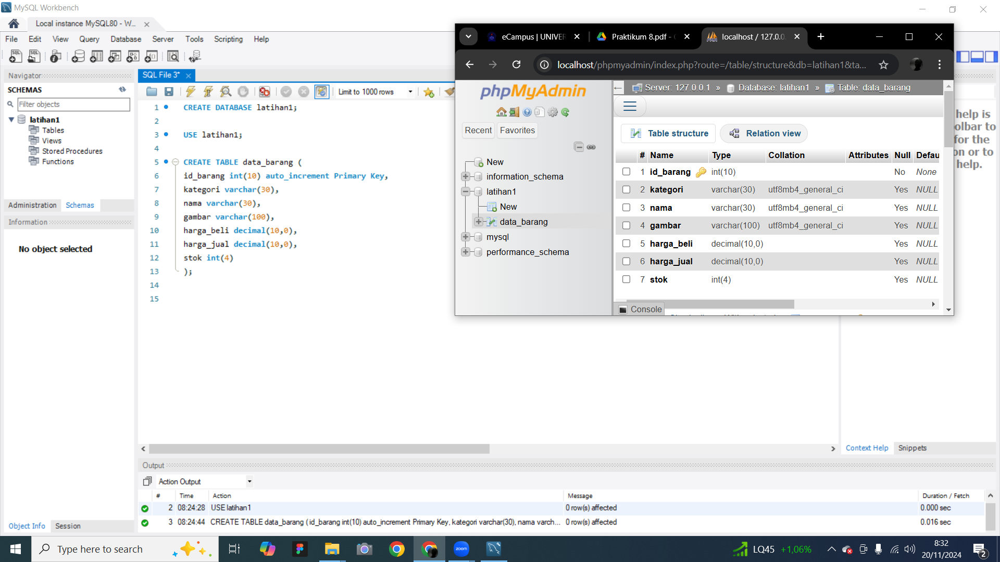
# 2. Menambahkan Data
- Gambar 1
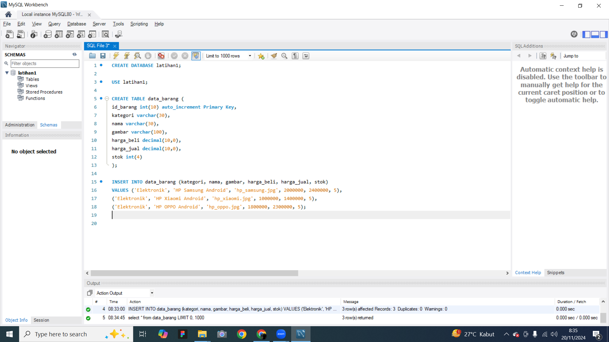
- Gambar 2
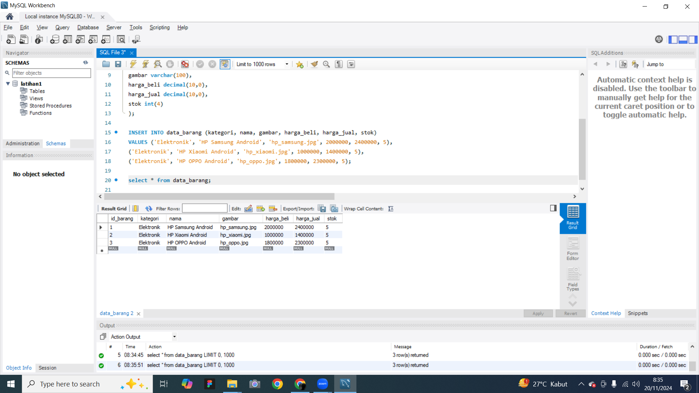
# 3. Buat file baru dengan nama koneksi.php
- Gambar 1
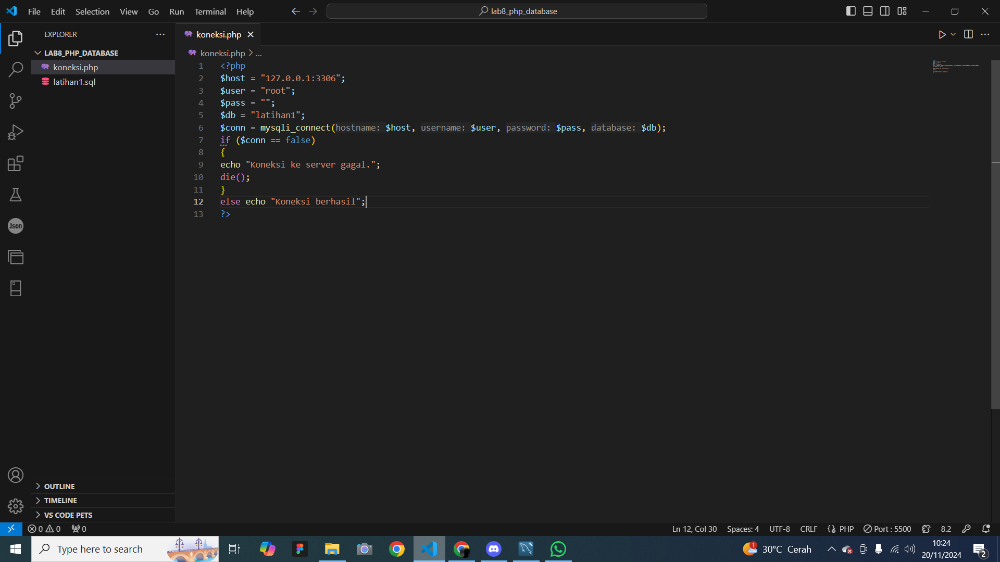
- Gambar 2
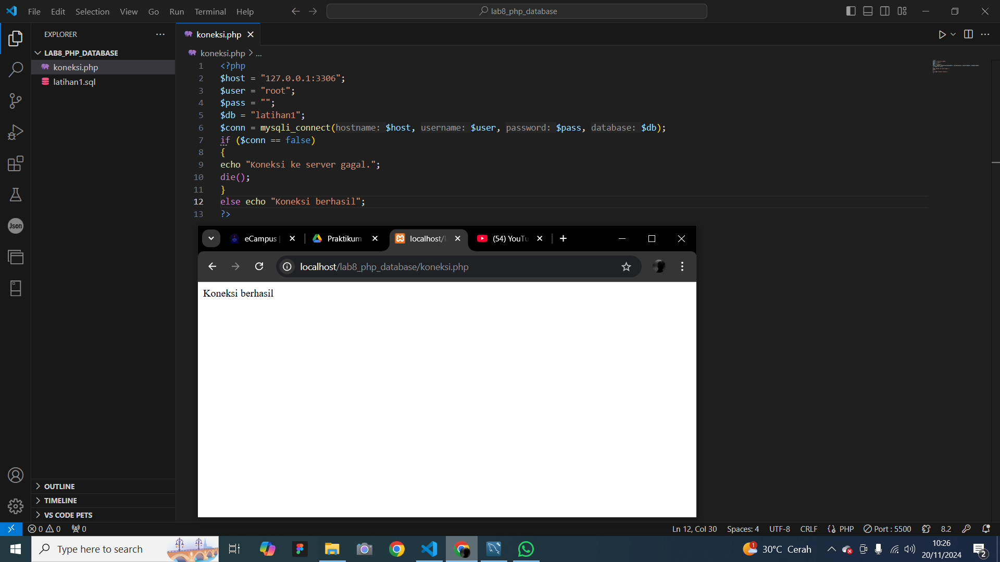
# 4. Buat file baru dengan nama index.php
- Gambar 1
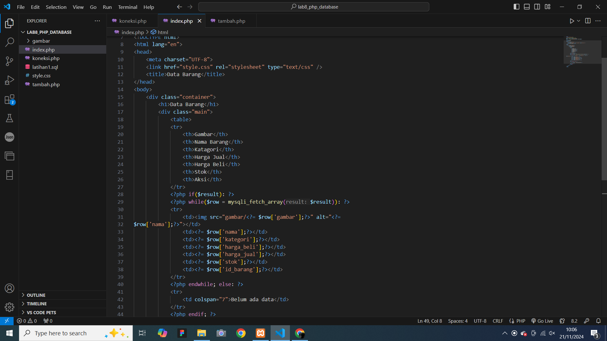
- Gambar 2
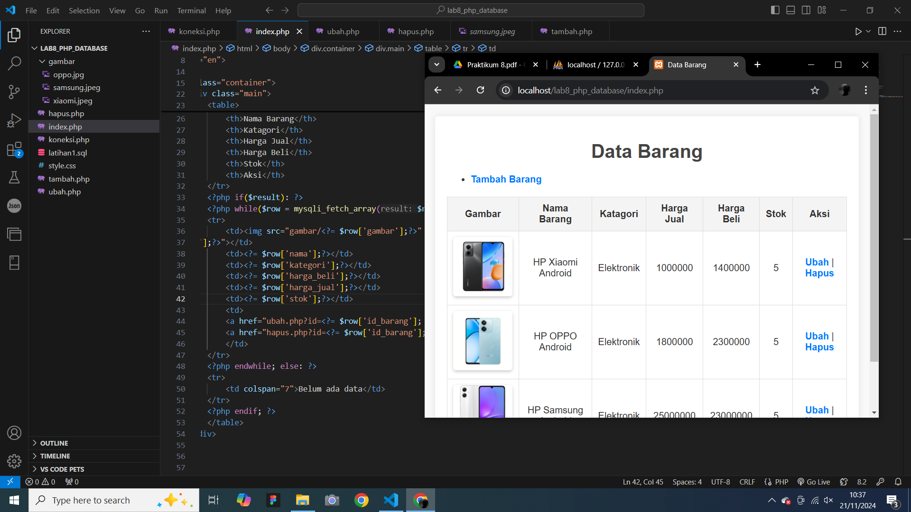
# 5. Buat file baru dengan nama tambah.php
- Gambar 1
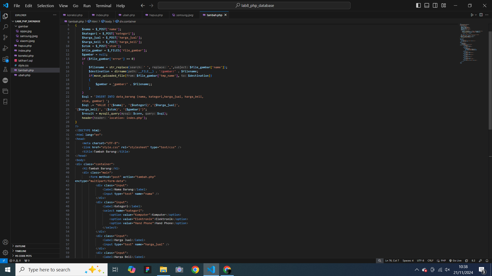
- Gambar 2
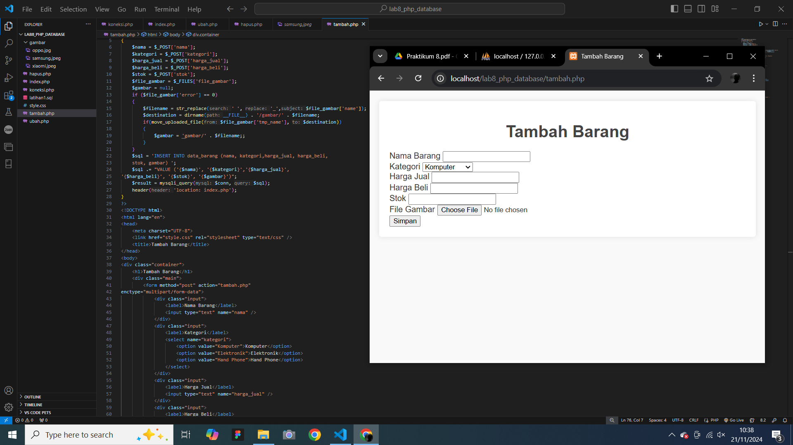
# 6. Buat file baru dengan nama ubah.php
- Gambar 1
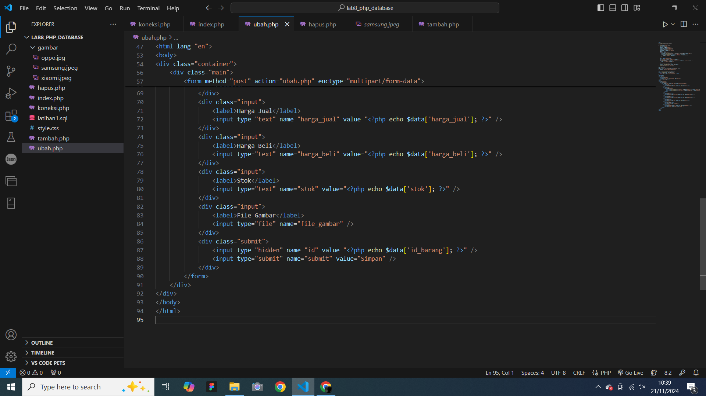
- Gambar 2
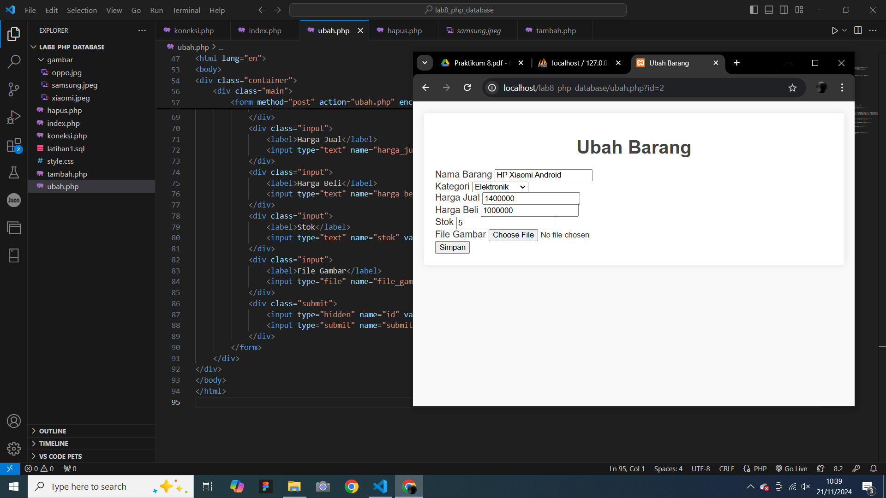
# 7. Buat file baru dengan nama hapus.php
- Gambar 1

- Gambar 2
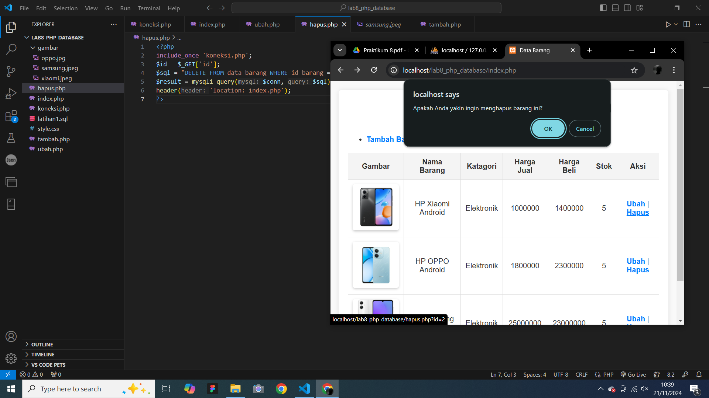
